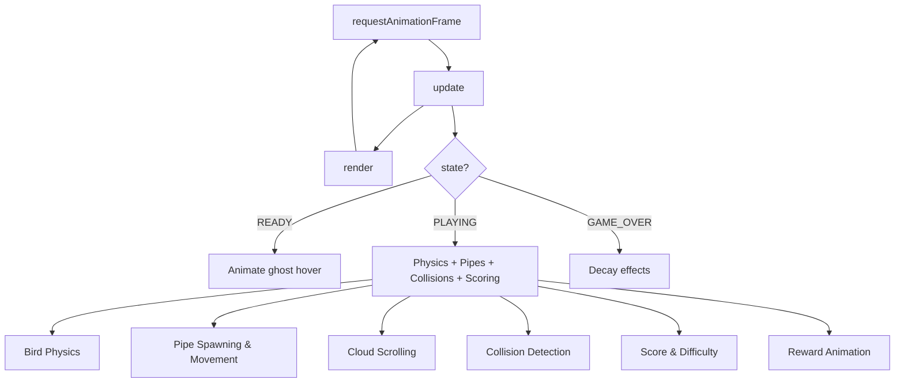
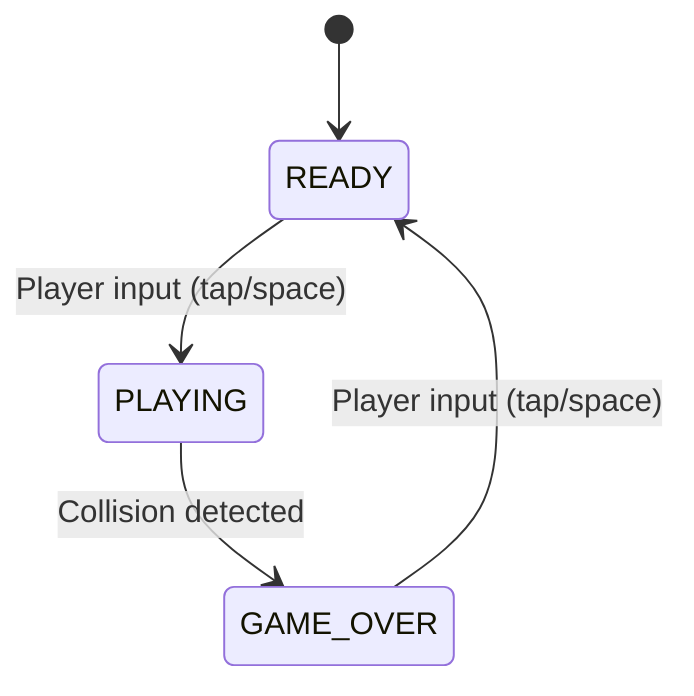

# Design Document: Flappy Kiro

## Overview

Flappy Kiro is a browser-based endless scroller game implemented in vanilla JavaScript with HTML5 Canvas. The player controls a ghost character that must navigate through gaps between vertically-scrolling pipe pairs. The game features a state machine (ready/playing/game over), progressive difficulty scaling, persistent high scores, and celebratory reward animations at score checkpoints.

The architecture follows a single-file game engine pattern using an IIFE (Immediately Invoked Function Expression) to encapsulate all game logic. The game loop is driven by `requestAnimationFrame` for smooth 60fps rendering. All rendering is done procedurally on a 400×600 canvas — no external sprite sheets are required (the ghost is drawn with Canvas 2D primitives).

### Key Design Decisions

1. **Single-file architecture**: All game logic lives in `game.js` for simplicity. The game is small enough that module splitting adds complexity without benefit.
2. **Procedural rendering**: The ghost, pipes, clouds, and ground are drawn with Canvas 2D API calls rather than sprite images. This keeps the game lightweight and makes it easy to adjust visual parameters.
3. **State enum pattern**: Game states are represented as numeric constants in a `STATE` object, with a single `state` variable controlling flow through the game loop.
4. **Entity-as-object-literal**: Game entities (bird, pipes, clouds) are plain objects/arrays — no class hierarchy. This is appropriate for a small game with few entity types.

## Architecture

The game uses a classic game loop architecture with three distinct phases per frame: **Input → Update → Render**.



### State Machine



### Rendering Pipeline (per frame)

The render order establishes the visual layering (back to front):

1. Sky gradient background
2. Clouds (parallax, varying opacity)
3. Pipes (with caps and highlights)
4. Ground (textured, scrolling)
5. Ghost (with glow, rotation, squish)
6. UI text (score, title, game over overlay)
7. Reward animation (pizza emoji)
8. Flash overlay (game over effect)

## Components and Interfaces

### Game Loop Controller

The top-level orchestrator that calls `update()` and `render()` each frame via `requestAnimationFrame`.

```javascript
function gameLoop() {
    update();
    render();
    requestAnimationFrame(gameLoop);
}
```

### State Manager

Controls game flow through three states:

| Function | Trigger | Effect |
|----------|---------|--------|
| `startGame()` | Input during READY | Sets state to PLAYING, applies first flap |
| `gameOver()` | Collision detected | Sets state to GAME_OVER, triggers effects, updates high score |
| `resetGame()` | Input during GAME_OVER | Resets all entities, sets state to READY |

### Bird (Ghost) Module

Manages the player character's physics and animation state.

**Interface:**
- `flap()`: Sets vertical velocity to `flapStrength`, triggers squish animation
- Physics applied each frame: gravity accumulation, velocity clamping, rotation calculation, squish decay

### Pipe Manager

Handles pipe lifecycle: spawning, scrolling, scoring detection, and cleanup.

**Interface:**
- `spawnPipe()`: Creates a new pipe pair at the right edge with randomized gap position
- Pipes move left by `pipeSpeed` per frame
- Score increments when pipe trailing edge passes bird x-position
- Pipes are removed from array when fully off-screen

### Collision System

AABB (Axis-Aligned Bounding Box) collision detection with a forgiving inset.

**Interface:**
- `checkCollisions()`: Tests bird hitbox against ground, ceiling, and all pipe rects
- `aabb(x1, y1, w1, h1, x2, y2, w2, h2)`: Pure boolean rectangle overlap test

### Difficulty System

Progressive scaling of game parameters based on score milestones.

**Interface:**
- `applyDifficulty()`: Called after each score increment, adjusts `pipeSpeed`, `gapSize`, and `pipeInterval` based on `Math.floor(score / 5)`

### Cloud System

Parallax scrolling cloud layer with varying speeds and opacity to simulate depth.

**Interface:**
- `initClouds()`: Generates 3-5 clouds with randomized position, size, speed, and opacity
- Each cloud scrolls left at its own speed; wraps to right edge when off-screen

### Reward System (New)

Pizza emoji celebration at score checkpoints (every 5 points).

**Interface:**
- `triggerReward()`: Starts a reward animation when a checkpoint is reached
- Animation state: scale (0→1→1), fade (1→0), timer countdown
- Rendered centered above ghost for ~1.5 seconds (90 frames at 60fps)

### Effects System

Visual feedback on game over.

**Interface:**
- Screen shake: Random translate offset decaying over 15 frames
- White flash: Alpha overlay decaying from 0.6 to 0

### Input Handler

Unified input routing for mouse click, touch, and keyboard (Space).

**Interface:**
- `onInput(e)`: Routes to `startGame()`, `flap()`, or `resetGame()` based on current state

### Audio System (New)

Sound effects for key game events.

**Interface:**
- `playSound(audioElement)`: Resets and plays an audio element
- Triggers: flap → `jump.wav`, game over → `game_over.wav`

## Data Models

### Bird State

```javascript
const bird = {
    x: 80,              // Fixed horizontal position (pixels)
    y: 300,             // Vertical position (pixels, center)
    w: 34,              // Width for hitbox
    h: 28,              // Height for hitbox
    vy: 0,              // Vertical velocity (pixels/frame)
    gravity: 0.4,       // Gravity acceleration (pixels/frame²)
    flapStrength: -7,   // Upward velocity on flap (negative = up)
    maxVel: 10,         // Maximum downward velocity
    rotation: 0,        // Current rotation angle (radians)
    squish: 0           // Squish animation counter (frames remaining)
};
```

### Pipe Object

```javascript
{
    x: 400,             // Horizontal position of left edge (pixels)
    gapCenter: 250,     // Vertical center of the gap (pixels)
    scored: false       // Whether this pipe has been counted for score
}
```

### Cloud Object

```javascript
{
    x: 150,             // Horizontal position (pixels)
    y: 80,              // Vertical position (pixels)
    w: 100,             // Width (pixels)
    h: 35,              // Height (pixels)
    speed: 0.5,         // Horizontal scroll speed (pixels/frame)
    opacity: 0.4        // Alpha transparency (0.2 - 0.6)
}
```

### Reward Animation State (New)

```javascript
{
    active: false,      // Whether animation is currently playing
    timer: 0,          // Frames remaining (90 = 1.5 seconds at 60fps)
    scale: 0,          // Current scale factor (0 → 1)
    alpha: 1           // Current opacity (1 → 0)
}
```

### Difficulty Parameters

```javascript
// Base values (level 0)
pipeSpeed: 2,          // pixels/frame
gapSize: 150,          // pixels
pipeInterval: 90,      // frames between spawns

// Per-level adjustments (level = Math.floor(score / 5))
pipeSpeed:    min(2 + level * 0.15, 4)
gapSize:      max(150 - level * 3, 100)
pipeInterval: max(90 - level * 3, 55)
```

### Game Constants

```javascript
const W = 400;                    // Canvas width
const H = 600;                    // Canvas height
const GROUND_H = 60;              // Ground/score bar height
const PIPE_WIDTH = 52;            // Pipe body width
const PIPE_CAP_H = 20;           // Pipe cap height
const PIPE_CAP_EXTEND = 4;       // Cap extension beyond pipe body (each side)
const HITBOX_INSET = 4;           // Forgiving collision inset (pixels)
const REWARD_DURATION = 90;       // Reward animation frames (1.5s at 60fps)
const CHECKPOINT_INTERVAL = 5;    // Points between checkpoints
```

## Correctness Properties

*A property is a characteristic or behavior that should hold true across all valid executions of a system — essentially, a formal statement about what the system should do. Properties serve as the bridge between human-readable specifications and machine-verifiable correctness guarantees.*

### Property 1: Gravity increases downward velocity with clamping

*For any* ghost state with vertical velocity `vy`, applying one frame of gravity (without flap) SHALL result in vertical velocity equal to `min(vy + gravity, maxVel)`. The velocity never exceeds `maxVel`.

**Validates: Requirements 2.2, 2.3**

### Property 2: Flap sets upward velocity

*For any* ghost state regardless of current vertical velocity, applying a flap SHALL set vertical velocity to exactly `flapStrength` (-7).

**Validates: Requirements 2.1**

### Property 3: AABB collision correctness

*For any* two rectangles (x1, y1, w1, h1) and (x2, y2, w2, h2) with positive dimensions, the `aabb` function SHALL return true if and only if the rectangles overlap (i.e., `x1 < x2 + w2 AND x1 + w1 > x2 AND y1 < y2 + h2 AND y1 + h1 > y2`).

**Validates: Requirements 4.1**

### Property 4: Pipe gap center stays within safe bounds

*For any* spawned pipe pair given a `gapSize` and canvas dimensions, the gap center SHALL satisfy: `gapCenter >= gapSize/2 + PIPE_CAP_H + 20` AND `gapCenter <= H - GROUND_H - gapSize/2 - PIPE_CAP_H - 20`, ensuring both pipes have visible body above/below their caps.

**Validates: Requirements 3.2, 3.3**

### Property 5: Score increments exactly once per pipe

*For any* pipe that scrolls from right to left past the ghost (i.e., `pipe.x + PIPE_WIDTH < bird.x`), the score SHALL increment by exactly 1, and the pipe's `scored` flag SHALL transition from `false` to `true` exactly once — subsequent frames with the same pipe SHALL not increment again.

**Validates: Requirements 5.1**

### Property 6: Difficulty scaling is monotonic and bounded

*For any* two scores where `scoreA < scoreB`, the difficulty parameters at `scoreB` SHALL be at least as hard as at `scoreA`: `pipeSpeed(B) >= pipeSpeed(A)`, `gapSize(B) <= gapSize(A)`, `pipeInterval(B) <= pipeInterval(A)`. Additionally, *for any* score, parameters SHALL remain within bounds: `pipeSpeed` in [2, 4], `gapSize` in [100, 150], `pipeInterval` in [55, 90].

**Validates: Requirements 9.1, 9.2, 9.3, 9.4**

### Property 7: High score is non-decreasing

*For any* sequence of game-over events with scores [s1, s2, ..., sN], the stored high score after processing all events SHALL equal `max(s1, s2, ..., sN)` and shall never decrease between events.

**Validates: Requirements 5.4, 6.1**

### Property 8: Reward triggers at exactly checkpoint intervals

*For any* score value `s > 0`, the reward animation SHALL trigger if and only if `s % CHECKPOINT_INTERVAL === 0` (i.e., s is a positive multiple of 5).

**Validates: Requirements 11.1**

### Property 9: Hitbox inset provides forgiving collision

*For any* ghost dimensions `(w, h)` and inset value, the collision hitbox SHALL have position `(x - w/2 + inset, y - h/2 + inset)` and dimensions `(w - 2*inset, h - 2*inset)`, always strictly smaller than the visual bounds.

**Validates: Requirements 4.4**

### Property 10: Cloud parallax invariants

*For any* set of initialized clouds, the count SHALL be in [3, 5], each cloud's opacity SHALL be in [0.2, 0.6], each cloud's speed SHALL be in [0.2, 1.0], and clouds with lower opacity SHALL have lower or equal speed compared to clouds with higher opacity (simulating distance-based parallax).

**Validates: Requirements 8.3, 8.4**

## Error Handling

### Local Storage Failures

- **Read failure**: If `localStorage.getItem` returns `null` or throws (e.g., private browsing mode), default high score to 0.
- **Write failure**: If `localStorage.setItem` throws (quota exceeded, permissions), silently catch the error — the game continues without persistence.
- **Parse failure**: If stored value is not a valid integer, default to 0 using `parseInt(...) || 0`.

### Audio Playback Failures

- **Autoplay policy**: Browsers may block audio until user interaction. Audio play calls should be wrapped in `.catch(() => {})` to prevent unhandled promise rejections.
- **Missing audio files**: If audio fails to load, the game continues without sound.

### Canvas Context

- **Context unavailable**: If `getContext('2d')` returns `null`, the game cannot function. This is an unrecoverable error (extremely rare in modern browsers).

### Frame Timing

- **requestAnimationFrame variance**: The game uses frame-count-based timing rather than delta-time. On displays above 60Hz, the game will run faster. This is acceptable for a casual game but noted as a known limitation.

## Testing Strategy

### Unit Tests (Example-Based)

Unit tests cover specific scenarios and edge cases:

- **State transitions**: Verify READY→PLAYING→GAME_OVER→READY cycle
- **Rendering calls**: Verify draw functions are called in correct order (mock canvas context)
- **Cloud initialization**: Verify 3-5 clouds are generated with valid bounds
- **Game over effects**: Verify flash alpha and shake timer are set correctly
- **Input routing**: Verify correct action is called for each state
- **Local storage edge cases**: Null, NaN, quota exceeded scenarios

### Property-Based Tests

Property tests use `fast-check` to verify universal properties with generated inputs. Each test runs minimum 100 iterations.

| Property | Generator Strategy |
|----------|-------------------|
| Property 1 (Gravity + clamping) | Random velocity in [-20, 20], verify min(vy+gravity, maxVel) |
| Property 2 (Flap) | Random velocity in [-20, 20], verify result === flapStrength |
| Property 3 (AABB) | Random rectangles with varying positions/sizes, verify overlap formula |
| Property 4 (Gap bounds) | Random gapSize in [100, 150], verify gapCenter within computed bounds |
| Property 5 (Scoring once) | Random pipe x-positions relative to bird, verify single increment |
| Property 6 (Difficulty monotone+bounded) | Random score pairs a < b, verify monotonicity and bounds |
| Property 7 (High score) | Random score sequences, verify max and non-decreasing |
| Property 8 (Reward trigger) | Random scores [1, 200], verify triggers iff score % 5 === 0 |
| Property 9 (Hitbox inset) | Random ghost dimensions, verify computed hitbox dimensions |
| Property 10 (Cloud parallax) | Random cloud arrays, verify count/opacity/speed bounds and correlation |

**Test Configuration:**
- Library: `fast-check`
- Minimum iterations: 100 per property
- Tag format: `Feature: flappy-kiro, Property {N}: {title}`

### Integration Tests

- **Full game cycle**: Start game, simulate flaps, pass pipes, verify score increments
- **Audio integration**: Verify sound plays on flap and game over (with user gesture)
- **Local storage round-trip**: Write high score, reload, verify retrieval

### Manual Testing

- **Visual verification**: Parallax cloud effect, ghost glow, pipe cap rendering
- **Performance**: Verify consistent 60fps on target devices
- **Touch input**: Verify responsiveness on mobile browsers
