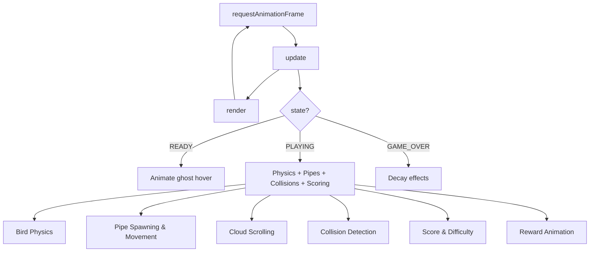
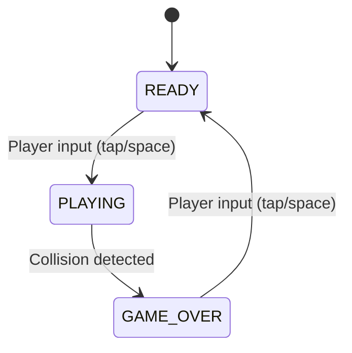

# Design Document: Flappy Kiro

## Overview

Flappy Kiro is a browser-based endless scroller game implemented in vanilla JavaScript with HTML5 Canvas. The player controls a ghost character that must navigate through gaps between vertically-scrolling pipe pairs. The game features a state machine (ready/playing/game over), progressive difficulty scaling, persistent high scores, and celebratory reward animations at score checkpoints.

The architecture follows a single-file game engine pattern using an IIFE (Immediately Invoked Function Expression) to encapsulate all game logic. The game loop is driven by `requestAnimationFrame` and uses **delta-time integration** so that physics are frame-rate independent — the elapsed time between frames is computed from the `requestAnimationFrame` timestamp and all motion is scaled by it. All rendering is done procedurally on a 400×600 canvas — no external sprite sheets are required (the ghost is drawn with Canvas 2D primitives).

All tunable physics and gameplay parameters live in an external `game-config.json` file at the project root, loaded once at startup. A hardcoded fallback configuration object is embedded in `game.js` so the game remains fully playable offline or if the fetch fails.

### Key Design Decisions

1. **Single-file architecture**: All game logic lives in `game.js` for simplicity. The game is small enough that module splitting adds complexity without benefit.
2. **Procedural rendering**: The ghost, pipes, clouds, and ground are drawn with Canvas 2D API calls rather than sprite images. This keeps the game lightweight and makes it easy to adjust visual parameters.
3. **State enum pattern**: Game states are represented as numeric constants in a `STATE` object, with a single `state` variable controlling flow through the game loop.
4. **Entity-as-object-literal**: Game entities (bird, pipes, clouds) are plain objects/arrays — no class hierarchy. This is appropriate for a small game with few entity types.
5. **External configuration**: All tunable parameters are defined in `game-config.json` rather than as inline constants. This decouples balancing/tuning from code and lets designers adjust physics without touching `game.js`. An embedded default config guarantees the game still runs if the file is missing or invalid.
6. **Delta-time physics**: Rather than assuming a fixed 60fps, physics integrate against the real elapsed time per frame. Velocities and accelerations are expressed in per-second units (px/s, px/s²), making behavior consistent across displays of any refresh rate.

## Architecture

The game uses a classic game loop architecture with three distinct phases per frame: **Input → Update → Render**.



### State Machine



### Rendering Pipeline (per frame)

The render order establishes the visual layering (back to front):

1. Sky gradient background
2. Clouds (parallax, varying opacity)
3. Pipes (with caps and highlights)
4. Ground (textured, scrolling)
5. Ghost (with glow, rotation, squish)
6. UI text (score, title, game over overlay)
7. Reward animation (pizza emoji)
8. Flash overlay (game over effect)

## Components and Interfaces

### Game Loop Controller

The top-level orchestrator that calls `update(dt)` and `render()` each frame via `requestAnimationFrame`. It computes `deltaTime` (in seconds) from the high-resolution timestamp supplied by `requestAnimationFrame`, and passes it into the physics update so all motion is frame-rate independent.

```javascript
let lastTime = 0;

function gameLoop(timestamp) {
    // First frame has no previous timestamp; seed it to avoid a huge dt
    if (!lastTime) lastTime = timestamp;
    let dt = (timestamp - lastTime) / 1000; // seconds elapsed
    lastTime = timestamp;
    // Clamp dt to avoid large jumps after tab switches / stalls
    dt = Math.min(dt, MAX_FRAME_DT); // e.g. 0.05s (~20fps floor)

    update(dt);
    render();
    requestAnimationFrame(gameLoop);
}
```

All velocity integration inside `update(dt)` multiplies by `dt`: position changes are `pos += velocity * dt` and velocity changes are `velocity += acceleration * dt`.

### Configuration Loading

At startup the game fetches `game-config.json` and merges it over the embedded default config. Loading is asynchronous; the game loop starts only after the config promise settles (success or failure), so gameplay always has a complete config.

**Interface:**
- `loadConfig()`: Returns a promise that resolves to the active config object. Attempts `fetch('game-config.json')`; on success parses and validates the JSON, then deep-merges it over `DEFAULT_CONFIG`. On fetch error, parse error, or validation failure, resolves with `DEFAULT_CONFIG` unchanged.
- `validateConfig(obj)`: Checks that required numeric fields are present and finite; returns the merged config or falls back to defaults for any missing/invalid field.
- `DEFAULT_CONFIG`: A hardcoded object embedded in `game.js` mirroring the structure of `game-config.json`, used as the fallback and as the merge base.

The startup sequence is: `loadConfig()` → apply config to entity initial values and difficulty bounds → `initClouds()` → `requestAnimationFrame(gameLoop)`.

### State Manager

Controls game flow through three states:

| Function | Trigger | Effect |
|----------|---------|--------|
| `startGame()` | Input during READY | Sets state to PLAYING, applies first flap |
| `gameOver()` | Collision detected | Sets state to GAME_OVER, triggers effects, updates high score |
| `resetGame()` | Input during GAME_OVER | Resets all entities, sets state to READY |

### Bird (Ghost) Module

Manages the player character's physics and animation state.

**Interface:**
- `flap()`: Sets vertical velocity to `config.physics.jumpVelocity` (-300 px/s), triggers squish animation
- Physics applied each frame (scaled by `dt`): gravity integration (`vy += gravity * dt`), velocity clamping to `maxVelocity`, position update (`y += vy * dt`), rotation calculation, squish decay

### Pipe Manager

Handles pipe lifecycle: spawning, scrolling, scoring detection, and cleanup.

**Interface:**
- `spawnPipe()`: Creates a new pipe pair at the right edge with randomized gap position
- Pipes move left by `wallSpeed * dt` each frame (per-second scroll speed)
- Spawning is **distance-based** rather than interval-based: a new pipe pair spawns when the most recently spawned pipe has moved `wallSpacing` pixels from the right edge (i.e., when `W - lastPipe.x >= wallSpacing`). This keeps horizontal spacing between pipes constant regardless of frame rate or scroll speed changes.
- Score increments when pipe trailing edge passes bird x-position
- Pipes are removed from array when fully off-screen

### Collision System

AABB (Axis-Aligned Bounding Box) collision detection with a forgiving inset.

**Interface:**
- `checkCollisions()`: Tests bird hitbox against ground, ceiling, and all pipe rects
- `aabb(x1, y1, w1, h1, x2, y2, w2, h2)`: Pure boolean rectangle overlap test

### Difficulty System

Progressive scaling of game parameters based on score milestones.

**Interface:**
- `applyDifficulty()`: Called after each score increment, adjusts `wallSpeed` (px/s), `gapSize` (px), and `wallSpacing` (px) based on `Math.floor(score / 5)`, clamped to the per-second/pixel bounds defined in `config.difficulty`

### Cloud System

Parallax scrolling cloud layer with varying speeds and opacity to simulate depth.

**Interface:**
- `initClouds()`: Generates 3-5 clouds with randomized position, size, speed, and opacity
- Each cloud scrolls left at its own speed; wraps to right edge when off-screen

### Reward System (New)

Pizza emoji celebration at score checkpoints (every 5 points).

**Interface:**
- `triggerReward()`: Starts a reward animation when a checkpoint is reached
- Animation state: scale (0→1→1), fade (1→0), time remaining countdown (seconds)
- Rendered centered above ghost for ~1.5 seconds (countdown decremented by `dt` each frame)

### Effects System

Visual feedback on game over.

**Interface:**
- Screen shake: Random translate offset decaying over 15 frames
- White flash: Alpha overlay decaying from 0.6 to 0

### Input Handler

Unified input routing for mouse click, touch, and keyboard (Space).

**Interface:**
- `onInput(e)`: Routes to `startGame()`, `flap()`, or `resetGame()` based on current state

### Audio System (New)

Sound effects for the three key game events: flap, score, and collision. The character and duration of each sound are defined in the sound design specification document [`audio-assets.md`](../../../audio-assets.md) at the project root.

**Sound set:**

| Event | File | Character | Approx. duration |
|-------|------|-----------|------------------|
| Flap | `jump.wav` | Whoosh | ~0.1 s |
| Score (pipe pair passed) | `score.wav` | Chime | ~0.2 s |
| Collision (game over) | `game_over.wav` | Thud | ~0.3 s |

> **Note:** `score.wav` is a **new asset** that must be created/sourced (see `audio-assets.md` for its target character and duration). `jump.wav` and `game_over.wav` already exist in `assets/`.

**Preloading:** At startup the Audio System creates one `Audio` element per sound and preloads all three (e.g., by setting `preload = 'auto'` and/or calling `.load()`), so that on a triggering event playback begins immediately without any further file loading.

**Independent playback:** Each sound uses its **own separate `Audio` element**. Because the three sounds never share a single element, they can play independently and concurrently — triggering one sound never cancels or interrupts another (e.g., a score chime and a collision thud fired in the same window both play).

**Interface:**
- `playSound(audioElement)`: Resets `audioElement.currentTime` to `0` (so a rapid re-trigger restarts the sound from the beginning rather than ignoring the call while it is still playing) and calls `audioElement.play()`, wrapping the returned promise in `.catch(() => {})` so that autoplay-policy blocks and missing/failed-to-load files fail silently without raising errors.
- Triggers:
  - flap → `playSound(flapSound)` (`jump.wav`)
  - score increment after passing a pipe pair → `playSound(scoreSound)` (`score.wav`)
  - game over → `playSound(collisionSound)` (`game_over.wav`)

## Data Models

### Bird State

Physics values are sourced from `config.physics` and expressed in per-second units. The `vy` field is in px/s and is integrated against `dt`.

```javascript
const bird = {
    x: 80,              // Fixed horizontal position (pixels)
    y: 300,             // Vertical position (pixels, center)
    w: 34,              // Width for hitbox
    h: 28,              // Height for hitbox
    vy: 0,              // Vertical velocity (pixels/second)
    rotation: 0,        // Current rotation angle (radians)
    squish: 0           // Squish animation factor (decays over time)
};

// Physics parameters come from config (per-second units):
//   gravity      = config.physics.gravity       // 800 px/s²
//   jumpVelocity = config.physics.jumpVelocity   // -300 px/s (applied on flap)
//   maxVelocity  = config.physics.maxVelocity    // clamp for downward vy

// Integration each frame (dt in seconds):
//   bird.vy = Math.min(bird.vy + gravity * dt, maxVelocity);
//   bird.y += bird.vy * dt;
```

### Pipe Object

```javascript
{
    x: 400,             // Horizontal position of left edge (pixels)
    gapCenter: 250,     // Vertical center of the gap (pixels)
    scored: false       // Whether this pipe has been counted for score
}
```

### Cloud Object

```javascript
{
    x: 150,             // Horizontal position (pixels)
    y: 80,              // Vertical position (pixels)
    w: 100,             // Width (pixels)
    h: 35,              // Height (pixels)
    speed: 18,          // Horizontal scroll speed (pixels/second)
    opacity: 0.4        // Alpha transparency (0.2 - 0.6)
}
```

### Reward Animation State (New)

```javascript
{
    active: false,      // Whether animation is currently playing
    timeLeft: 0,        // Seconds remaining (1.5 = full duration)
    scale: 0,           // Current scale factor (0 → 1)
    alpha: 1            // Current opacity (1 → 0)
}
```

### Configuration Object (loaded from `game-config.json`)

All tunable parameters are loaded from `game-config.json` at the project root and merged over the embedded `DEFAULT_CONFIG`. The structure below also serves as the default fallback. Physics values are in per-second units (px/s, px/s²); distances are in pixels.

```json
{
  "canvas": {
    "width": 400,
    "height": 600,
    "groundHeight": 60
  },
  "physics": {
    "gravity": 800,
    "jumpVelocity": -300,
    "maxVelocity": 600
  },
  "walls": {
    "speed": 120,
    "gapSize": 140,
    "spacing": 350,
    "width": 52,
    "capHeight": 20,
    "capExtend": 4
  },
  "difficulty": {
    "stepInterval": 5,
    "speed":   { "base": 120, "step": 9,  "max": 240 },
    "gapSize": { "base": 140, "step": 3,  "min": 100 },
    "spacing": { "base": 350, "step": 9,  "min": 230 }
  },
  "reward": {
    "checkpointInterval": 5,
    "durationSeconds": 1.5,
    "emoji": "🍕"
  },
  "clouds": {
    "minCount": 3,
    "maxCount": 5,
    "minOpacity": 0.2,
    "maxOpacity": 0.6,
    "minSpeed": 7,
    "maxSpeed": 36
  },
  "hitboxInset": 4
}
```

**Field reference:**

| Path | Meaning | Unit |
|------|---------|------|
| `canvas.width` / `canvas.height` | Canvas render dimensions | px |
| `canvas.groundHeight` | Ground / score bar height | px |
| `physics.gravity` | Downward acceleration | px/s² |
| `physics.jumpVelocity` | Velocity applied on flap (negative = up) | px/s |
| `physics.maxVelocity` | Clamp for downward fall velocity | px/s |
| `walls.speed` | Initial pipe scroll speed | px/s |
| `walls.gapSize` | Initial vertical gap between pipes | px |
| `walls.spacing` | Horizontal distance between spawned pipe pairs | px |
| `walls.width` | Pipe body width | px |
| `walls.capHeight` | Pipe cap height | px |
| `walls.capExtend` | Cap extension beyond body each side | px |
| `difficulty.stepInterval` | Points between difficulty steps | points |
| `difficulty.speed` | `wallSpeed` base / per-level step / max | px/s |
| `difficulty.gapSize` | `gapSize` base / per-level step / min | px |
| `difficulty.spacing` | `wallSpacing` base / per-level step / min | px |
| `reward.checkpointInterval` | Points between reward checkpoints | points |
| `reward.durationSeconds` | Reward animation duration | s |
| `clouds.*` | Count, opacity, and per-second speed bounds | mixed |
| `hitboxInset` | Forgiving collision inset | px |

### Difficulty Parameters (per-second / pixel terms)

Difficulty is applied in discrete steps where `level = Math.floor(score / config.difficulty.stepInterval)`. Using the default config values:

```javascript
// level = Math.floor(score / 5)
wallSpeed   = min(speed.base   + level * speed.step,   speed.max)    // min(120 + level*9,  240)  px/s
gapSize     = max(gapSize.base - level * gapSize.step, gapSize.min)  // max(140 - level*3,  100)  px
wallSpacing = max(spacing.base - level * spacing.step, spacing.min)  // max(350 - level*9,  230)  px
```

`wallSpeed` increases from 120 px/s up to 240 px/s; `gapSize` decreases from 140 px down to 100 px; `wallSpacing` decreases from 350 px down to 230 px. All three are monotonic in score and clamped to their bounds.

### Runtime Constants Derived from Config

```javascript
const W = config.canvas.width;            // 400
const H = config.canvas.height;           // 600
const GROUND_H = config.canvas.groundHeight;  // 60
const PIPE_WIDTH = config.walls.width;        // 52
const PIPE_CAP_H = config.walls.capHeight;    // 20
const PIPE_CAP_EXTEND = config.walls.capExtend;   // 4
const HITBOX_INSET = config.hitboxInset;          // 4
const REWARD_DURATION = config.reward.durationSeconds;  // 1.5 (seconds)
const CHECKPOINT_INTERVAL = config.reward.checkpointInterval;  // 5
const MAX_FRAME_DT = 0.05;   // Clamp for elapsed time per frame (~20fps floor)
```

## Correctness Properties

*A property is a characteristic or behavior that should hold true across all valid executions of a system — essentially, a formal statement about what the system should do. Properties serve as the bridge between human-readable specifications and machine-verifiable correctness guarantees.*

### Property 1: Gravity integrates over delta-time with clamping

*For any* ghost state with vertical velocity `vy` (px/s) and *any* elapsed time `dt > 0` seconds, applying gravity for that frame (without flap) SHALL result in vertical velocity equal to `min(vy + gravity * dt, maxVelocity)`, where `gravity = 800` px/s² and `maxVelocity` is the configured clamp. The velocity never exceeds `maxVelocity`.

**Validates: Requirements 2.2, 2.3**

### Property 2: Flap sets upward velocity

*For any* ghost state regardless of current vertical velocity, applying a flap SHALL set vertical velocity to exactly `jumpVelocity` (-300 px/s).

**Validates: Requirements 2.1**

### Property 3: AABB collision correctness

*For any* two rectangles (x1, y1, w1, h1) and (x2, y2, w2, h2) with positive dimensions, the `aabb` function SHALL return true if and only if the rectangles overlap (i.e., `x1 < x2 + w2 AND x1 + w1 > x2 AND y1 < y2 + h2 AND y1 + h1 > y2`).

**Validates: Requirements 4.1**

### Property 4: Pipe gap center stays within safe bounds

*For any* spawned pipe pair given a `gapSize` (default 140 px) and canvas dimensions, the gap center SHALL satisfy: `gapCenter >= gapSize/2 + PIPE_CAP_H + 20` AND `gapCenter <= H - GROUND_H - gapSize/2 - PIPE_CAP_H - 20`, ensuring both pipes have visible body above/below their caps.

**Validates: Requirements 3.2, 3.3**

### Property 5: Score increments exactly once per pipe

*For any* pipe that scrolls from right to left past the ghost (i.e., `pipe.x + PIPE_WIDTH < bird.x`), the score SHALL increment by exactly 1, and the pipe's `scored` flag SHALL transition from `false` to `true` exactly once — subsequent frames with the same pipe SHALL not increment again.

**Validates: Requirements 5.1**

### Property 6: Difficulty scaling is monotonic and bounded

*For any* two scores where `scoreA < scoreB`, the difficulty parameters at `scoreB` SHALL be at least as hard as at `scoreA`: `wallSpeed(B) >= wallSpeed(A)`, `gapSize(B) <= gapSize(A)`, `wallSpacing(B) <= wallSpacing(A)`. Additionally, *for any* score, parameters SHALL remain within bounds: `wallSpeed` in [120, 240] px/s, `gapSize` in [100, 140] px, `wallSpacing` in [230, 350] px.

**Validates: Requirements 9.1, 9.2, 9.3, 9.4**

### Property 7: High score is non-decreasing

*For any* sequence of game-over events with scores [s1, s2, ..., sN], the stored high score after processing all events SHALL equal `max(s1, s2, ..., sN)` and shall never decrease between events.

**Validates: Requirements 5.4, 6.1**

### Property 8: Reward triggers at exactly checkpoint intervals

*For any* score value `s > 0`, the reward animation SHALL trigger if and only if `s % CHECKPOINT_INTERVAL === 0` (i.e., s is a positive multiple of 5).

**Validates: Requirements 11.1**

### Property 9: Hitbox inset provides forgiving collision

*For any* ghost dimensions `(w, h)` and inset value, the collision hitbox SHALL have position `(x - w/2 + inset, y - h/2 + inset)` and dimensions `(w - 2*inset, h - 2*inset)`, always strictly smaller than the visual bounds.

**Validates: Requirements 4.4**

### Property 10: Cloud parallax invariants

*For any* set of initialized clouds, the count SHALL be in [3, 5], each cloud's opacity SHALL be in [0.2, 0.6], each cloud's speed SHALL be in [7, 36] px/s, and clouds with lower opacity SHALL have lower or equal speed compared to clouds with higher opacity (simulating distance-based parallax).

**Validates: Requirements 8.3, 8.4**

### Property 11: Config loading falls back to defaults on failure

*For any* outcome of the `game-config.json` fetch — success with valid JSON, fetch failure, malformed JSON, or JSON missing/with invalid (non-finite) numeric fields — `loadConfig()` SHALL resolve with a complete config object: a fully populated config equals the embedded `DEFAULT_CONFIG` for every field that is absent or invalid in the loaded file, and equals the loaded value only for fields that are present and valid. The resolved config SHALL never contain a missing or non-finite required field.

**Validates: Requirements 1.1, 1.3**

## Error Handling

### Local Storage Failures

- **Read failure**: If `localStorage.getItem` returns `null` or throws (e.g., private browsing mode), default high score to 0.
- **Write failure**: If `localStorage.setItem` throws (quota exceeded, permissions), silently catch the error — the game continues without persistence.
- **Parse failure**: If stored value is not a valid integer, default to 0 using `parseInt(...) || 0`.

### Audio Playback Failures

- **Three independent sounds**: The audio set is `jump.wav` (flap), `score.wav` (score increment — a new asset), and `game_over.wav` (collision). All three use separate preloaded `Audio` elements and follow the same graceful-failure handling described below.
- **Autoplay policy**: Browsers may block audio until user interaction. Every `playSound` call wraps the `play()` promise in `.catch(() => {})` to prevent unhandled promise rejections, and the game loop continues uninterrupted.
- **Missing audio files**: If any audio file (including the newly added `score.wav`) is missing or fails to load, the `.catch(() => {})` swallows the error and the game continues without that sound. No game state depends on audio succeeding.

### Canvas Context

- **Context unavailable**: If `getContext('2d')` returns `null`, the game cannot function. This is an unrecoverable error (extremely rare in modern browsers).

### Configuration Loading Failures

- **Fetch failure**: If `fetch('game-config.json')` rejects (offline, file served from `file://`, network error) or returns a non-OK status, `loadConfig()` resolves with the embedded `DEFAULT_CONFIG`. The game remains fully playable offline.
- **Parse failure**: If the response body is not valid JSON, the parse error is caught and `DEFAULT_CONFIG` is used.
- **Validation failure**: If the parsed object is missing required fields or contains non-finite numeric values, those fields fall back to their `DEFAULT_CONFIG` values via deep merge. A config that is partially valid keeps its valid fields and defaults the rest.

### Frame Timing

- **Delta-time integration**: The game derives `deltaTime` from the `requestAnimationFrame` timestamp and scales all physics by it, so behavior is consistent across 60Hz, 120Hz, and other refresh rates.
- **Large gaps / stalls**: After a tab switch or stall the elapsed time can spike. `deltaTime` is clamped to `MAX_FRAME_DT` (0.05s, a ~20fps floor) to prevent the ghost from "teleporting" through pipes when a large frame gap occurs.
- **First frame**: The first animation frame seeds `lastTime` from its own timestamp so the initial `deltaTime` is ~0 rather than the time since page load.

## Testing Strategy

### Unit Tests (Example-Based)

Unit tests cover specific scenarios and edge cases:

- **State transitions**: Verify READY→PLAYING→GAME_OVER→READY cycle
- **Rendering calls**: Verify draw functions are called in correct order (mock canvas context)
- **Cloud initialization**: Verify 3-5 clouds are generated with valid bounds
- **Game over effects**: Verify flash alpha and shake timer are set correctly
- **Input routing**: Verify correct action is called for each state
- **Local storage edge cases**: Null, NaN, quota exceeded scenarios
- **Config merge**: Verify a valid partial config overrides only its fields and defaults the rest
- **Delta-time integration**: Verify `bird.y` and `bird.vy` advance correctly for representative `dt` values (e.g., 1/60s, 1/120s)
- **Score-sound trigger**: Verify `playSound(scoreSound)` (`score.wav`) is invoked when the score increments on passing a pipe pair, and that `currentTime` is reset to 0 on each trigger (mock the `Audio` element)

### Property-Based Tests

Property tests use `fast-check` to verify universal properties with generated inputs. Each test runs minimum 100 iterations.

| Property | Generator Strategy |
|----------|-------------------|
| Property 1 (Gravity + clamping) | Random velocity in [-600, 600] px/s and random dt in (0, 0.05]s, verify `min(vy + gravity*dt, maxVelocity)` |
| Property 2 (Flap) | Random velocity in [-600, 600] px/s, verify result === jumpVelocity (-300) |
| Property 3 (AABB) | Random rectangles with varying positions/sizes, verify overlap formula |
| Property 4 (Gap bounds) | Random gapSize in [100, 140], verify gapCenter within computed bounds |
| Property 5 (Scoring once) | Random pipe x-positions relative to bird, verify single increment |
| Property 6 (Difficulty monotone+bounded) | Random score pairs a < b, verify monotonicity and per-second/pixel bounds |
| Property 7 (High score) | Random score sequences, verify max and non-decreasing |
| Property 8 (Reward trigger) | Random scores [1, 200], verify triggers iff score % 5 === 0 |
| Property 9 (Hitbox inset) | Random ghost dimensions, verify computed hitbox dimensions |
| Property 10 (Cloud parallax) | Random cloud arrays, verify count/opacity/speed bounds (px/s) and correlation |
| Property 11 (Config fallback) | Random partial/invalid config objects (missing fields, non-finite values, malformed input), verify merged result equals defaults for invalid fields and is always complete |

**Test Configuration:**
- Library: `fast-check`
- Minimum iterations: 100 per property
- Tag format: `Feature: flappy-kiro, Property {N}: {title}`

### Integration Tests

- **Full game cycle**: Start game, simulate flaps, pass pipes, verify score increments
- **Audio integration**: Verify all three sounds play on their events — flap (`jump.wav`), score increment (`score.wav`), and game over (`game_over.wav`) — with a user gesture, and verify they play independently when triggered in the same window
- **Local storage round-trip**: Write high score, reload, verify retrieval
- **Config load (success)**: Serve a valid `game-config.json`, verify the game applies its values
- **Config load (failure)**: Simulate a failed fetch, verify the game starts with `DEFAULT_CONFIG` and remains playable
- **Frame-rate independence**: Run a fixed sequence of inputs at simulated 60fps and 120fps, verify the ghost reaches equivalent positions over the same elapsed time

### Manual Testing

- **Visual verification**: Parallax cloud effect, ghost glow, pipe cap rendering
- **Performance**: Verify consistent 60fps on target devices
- **Touch input**: Verify responsiveness on mobile browsers
